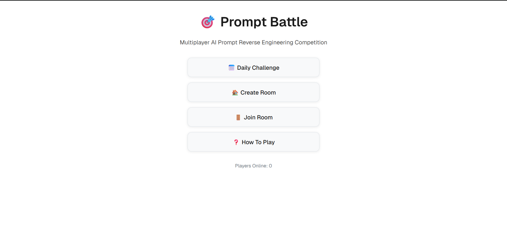
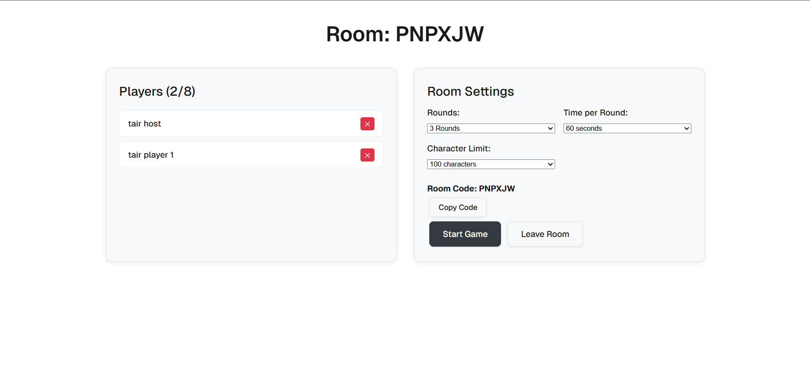
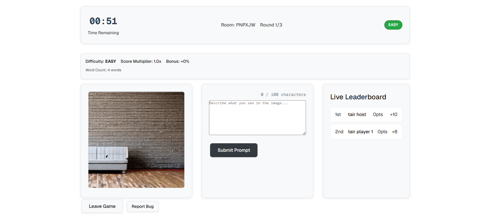
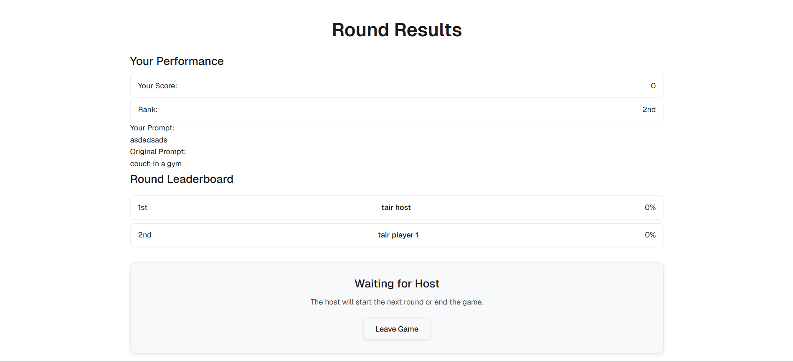
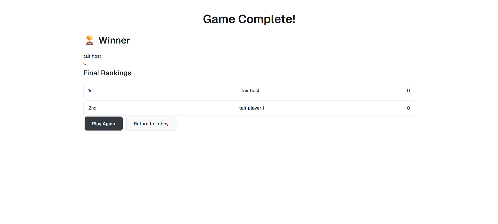
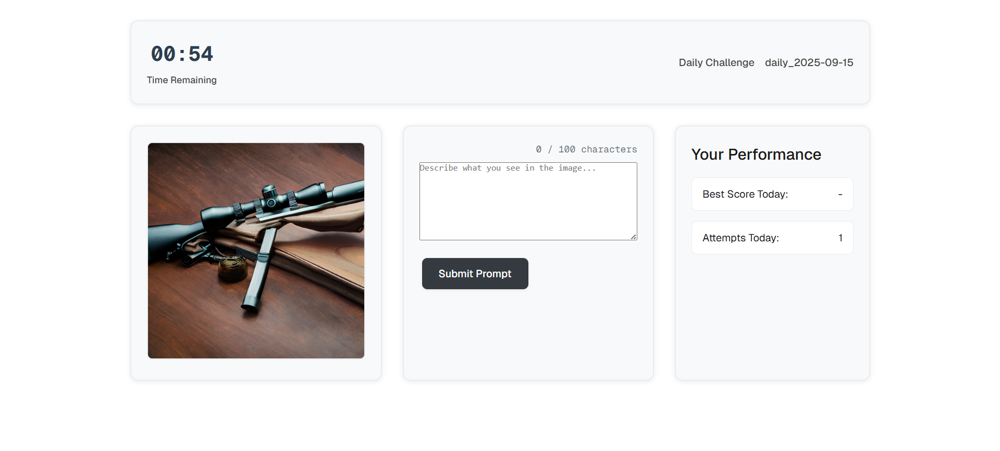

# Prompt Battle WebGame - AI-Powered Multiplayer Challenge

*A comprehensive game development project exploring AI, software engineering, and multiplayer gaming*

*⭐ If you like this project, consider giving it a star to support and follow its progress!*
---

## 🎯 Project Overview

**Prompt Battle WebGame** is a real-time multiplayer game that challenges players to reverse-engineer AI image generation prompts. As a Software Engineering student at Fontys ICT, I developed this project to explore the intersection of artificial intelligence, game development, and modern web technologies. The game combines competitive gameplay with educational elements, helping players understand how AI interprets and generates visual content.

## 🎥 DEMO Video

[](https://youtu.be/j7SLrSRv9DM)

### 🎮 The Core Concept

Players are presented with AI-generated images and must guess the original prompt used to create them. It's like "reverse Pictionary" - instead of drawing what you see, you describe what you see in terms that an AI image generator would understand. The game tests players' ability to think like an AI system while competing against friends in real-time.

### 🏫 Academic Context

This project serves as my **Project #1** for Fontys ICT, demonstrating proficiency in multiple learning outcomes across software development, AI integration, and game design. The project showcases full-stack development skills, real-time communication, database management, and user experience design.

---

## 🚀 Key Features

### Multiplayer Gameplay
- **Real-time rooms** with 6-character join codes
- **Host-controlled settings** (rounds, time limits, character limits)
- **Live leaderboards** and scoring system
- **Difficulty-based challenges** (Easy/Medium/Hard)

### AI Integration
- **1,320+ curated prompt-image pairs** with difficulty classification
- **Intelligent scoring system** that evaluates prompt similarity
- **Difficulty analysis** using natural language processing heuristics
- **Bonus scoring** for creativity, conciseness, and technical accuracy

### Modern Web Technologies
- **Node.js/Express** backend with Socket.IO for real-time communication
- **SQLite database** for game state and player data
- **Responsive frontend** with clean, monochrome design
- **Public hosting** via ngrok tunneling for easy sharing

### User Experience
- **Clean, academic interface** perfect for workshops and presentations
- **Timer management** with ghost timer prevention
- **Character counting** and input validation
- **Cross-device compatibility** (desktop, tablet, mobile)

---

## 📸 Screenshots

### Main Menu

*Clean lobby interface with daily challenges and multiplayer options*

### Room Creation & Host Controls

*Host interface showing player management and game settings*

### Active Gameplay

*Real-time gameplay with timer, difficulty indicator, and live leaderboard*

### Results & Scoring

*Detailed scoring breakdown with performance analysis*

### Game Completion

*Final rankings and game completion screen*

### Daily Challenge

*Solo gameplay mode with performance tracking*

---

## 🛠️ Technical Architecture

### Backend Stack
- **Node.js** with Express.js framework
- **Socket.IO** for real-time multiplayer communication
- **SQLite** database with custom schema
- **Custom scoring algorithm** for prompt evaluation
- **Image serving** with validation and caching

### Frontend Stack
- **Vanilla JavaScript** with modern ES6+ features
- **CSS3** with custom properties and responsive design
- **HTML5** semantic structure
- **Real-time UI updates** via WebSocket events

### AI & Data Processing
- **1,320 prompt-image pairs** manually curated and analyzed
- **Difficulty classification** using NLP heuristics
- **Semantic similarity scoring** for prompt evaluation
- **Bonus calculation** system for advanced features

### Deployment & Hosting
- **Local development** with hot-reload
- **Network access** via IP configuration
- **Public hosting** through ngrok tunneling with reserved domain support
- **Consistent domain hosting** - same URL every server restart
- **Automated startup scripts** for easy deployment and ngrok configuration

---

## 🎓 Learning Outcomes Integration

### LO1: You Orient Yourself in Your Domain
- **Domain Research**: Deep dive into AI image generation and prompt engineering
- **Technology Assessment**: Evaluation of Node.js, Socket.IO, and SQLite for real-time multiplayer
- **User Research**: Understanding target audience (students, educators, AI enthusiasts)
- **Competitive Analysis**: Study of existing prompt-based games and educational tools

### LO2: You Make Products
#### Analyze
- **Requirements Analysis**: Comprehensive game specification document
- **Technical Analysis**: System architecture and technology stack decisions
- **User Story Mapping**: Player journeys and interaction flows
- **Data Analysis**: Prompt difficulty classification and scoring metrics

#### Advise
- **Technical Documentation**: API documentation and system architecture guides
- **Best Practices**: Code organization and development workflow recommendations
- **Performance Optimization**: Database indexing and real-time communication efficiency
- **Security Considerations**: Input validation and XSS prevention strategies

#### Design
- **System Architecture**: C4 model diagrams and database schema design
- **User Interface Design**: Wireframes and responsive layout specifications
- **Game Mechanics Design**: Scoring algorithms and difficulty progression systems
- **API Design**: RESTful endpoints and WebSocket event structures

### LO3: Professional Standard
- **Project Planning**: Agile development with feature prioritization
- **Code Quality**: Consistent formatting, commenting, and error handling
- **Version Control**: Git workflow with meaningful commit messages
- **Testing Strategy**: Manual testing protocols and bug tracking
- **Documentation**: Comprehensive README, API docs, and deployment guides

### LO4: Personal Leadership
- **Self-Directed Learning**: Independent research into AI and game development
- **Time Management**: Project timeline adherence and milestone completion
- **Continuous Improvement**: Iterative development based on testing feedback
- **Knowledge Sharing**: Documentation and tutorial creation for others

---

## 🐛 Bugs & Issues Resolved

### Critical Issues Fixed
1. **Ghost Timer Bug**: Multiple timers running simultaneously after round completion
   - **Solution**: Implemented proper timer cleanup with `clearInterval()` and state management
   - **Impact**: Smooth round transitions and better user experience

2. **Scoring Inaccuracy**: Basic word matching led to inconsistent results
   - **Solution**: Developed semantic similarity algorithm with difficulty multipliers
   - **Impact**: More accurate and fair scoring system

3. **Dataset Size Issues**: Original 100k+ images caused performance problems
   - **Solution**: Curated dataset of 1,320 high-quality prompt-image pairs
   - **Impact**: Faster loading and better game balance

4. **Network Access Problems**: Game only accessible via localhost
   - **Solution**: ngrok integration with automated setup scripts
   - **Impact**: Easy sharing with remote players

### Minor Issues Addressed
- **CSS Layout Problems**: Fixed responsive design inconsistencies
- **Input Validation**: Added character limits and prompt validation
- **Error Handling**: Improved error messages and fallback states
- **Performance**: Optimized image loading and database queries

---

## 💡 Future Ideas & Enhancements

### Short-term Improvements (Next Sprint)
- **User Authentication**: Player accounts and persistent statistics
- **More Game Modes**: Time-attack, tournament brackets, team play
- **Enhanced Scoring**: Machine learning-based prompt similarity
- **Mobile Optimization**: Touch-friendly interface improvements

### Medium-term Features
- **AI Integration**: Real-time prompt generation using GPT models
- **Social Features**: Friends lists, chat system, achievements
- **Analytics Dashboard**: Player performance insights and game statistics
- **Content Management**: Admin panel for adding new prompt-image pairs

### Long-term Vision
- **Educational Platform**: Integration with AI/ML courses and workshops
- **Community Features**: User-generated content and prompt sharing
- **Advanced AI**: Custom image generation based on player descriptions
- **Multi-language Support**: Internationalization for global accessibility

---

## 📋 TODO List & Validation Plan

### Documentation TODO
- [ ] **API Documentation**: Complete endpoint documentation with examples
- [ ] **Deployment Guide**: Step-by-step hosting instructions for different platforms
- [ ] **User Manual**: Comprehensive gameplay guide for new players
- [ ] **Developer Guide**: Setup instructions and contribution guidelines
- [ ] **Testing Documentation**: Test cases and quality assurance procedures

### Technical Validation TODO
- [ ] **Performance Testing**: Load testing with multiple concurrent players
- [ ] **Security Audit**: Penetration testing and vulnerability assessment
- [ ] **Cross-browser Testing**: Compatibility verification across different browsers
- [ ] **Mobile Testing**: Touch interface optimization and responsive design validation
- [ ] **Accessibility Testing**: WCAG compliance and screen reader compatibility

### Educational Validation TODO
- [ ] **User Testing**: Feedback collection from students and educators
- [ ] **Learning Outcome Assessment**: Evaluation against Fontys ICT criteria
- [ ] **Academic Presentation**: Demo for faculty and peer review
- [ ] **Research Documentation**: Analysis of AI prompt engineering techniques
- [ ] **Portfolio Integration**: Professional portfolio preparation

### Quality Assurance TODO
- [ ] **Code Review**: Peer review of all major components
- [ ] **Bug Testing**: Comprehensive testing of all game features
- [ ] **Performance Optimization**: Database query optimization and caching
- [ ] **Error Handling**: Comprehensive error scenarios and recovery
- [ ] **Backup Strategy**: Data backup and recovery procedures

---

## 🚀 Quick Start Guide

### Prerequisites
- Node.js (v14 or higher)
- Git
- Modern web browser
- ngrok account (for public hosting)

### Installation
```bash
# Clone the repository
git clone https://github.com/tairqaldy/prompt-battle-webgame.git
cd prompt-battle-webgame

# Install dependencies
cd backend
npm install

# Start the game
node server.js
```

### Using the Startup Script
```bash
# Double-click start-game.bat for interactive menu
# Choose option 5 to configure your ngrok reserved domain
# Choose option 2 for public access via ngrok
# Share your consistent ngrok URL with friends!
```

### ngrok Reserved Domain Configuration
The project now supports ngrok reserved domains for consistent hosting URLs:

1. **Setup your domain**: Use option `[5] Setup ngrok domain configuration` in start-game.bat
2. **Consistent URL**: Your game will always be hosted on the same domain
3. **Easy sharing**: No need to update links when restarting the server
4. **Secure configuration**: Auth tokens are git-ignored for privacy

For detailed setup instructions, see: [ngrok Reserved Domain Setup Guide](docs/NGROK-RESERVED-DOMAIN-SETUP.md)

### Manual Commands
```bash
# Local only
cd backend && node server.js

# With ngrok (public access)
cd backend && start node server.js
cd .. && start ngrok.exe http 3000
```

---

## 📊 Project Statistics

### Development Metrics
- **Total Development Time**: ~3 weeks
- **Lines of Code**: ~2,500+ (JavaScript, CSS, HTML)
- **Database Entries**: 1,320 prompt-image pairs
- **API Endpoints**: 12 REST endpoints + WebSocket events
- **Test Coverage**: Manual testing of all major features

### Technical Achievements
- **Real-time Multiplayer**: Sub-second response times
- **Cross-platform Compatibility**: Works on desktop, tablet, mobile
- **Public Hosting**: Easy sharing via ngrok tunneling
- **Responsive Design**: Adapts to all screen sizes
- **Performance**: Handles up to 8 concurrent players

### Educational Impact
- **AI Understanding**: Deep dive into prompt engineering
- **Full-stack Development**: End-to-end application development
- **Game Design**: User experience and engagement optimization
- **Project Management**: Agile development and milestone tracking

---

## 🎯 Success Metrics

### Technical Success
- ✅ **Zero Critical Bugs**: All major issues resolved
- ✅ **Cross-platform Compatibility**: Works on all modern browsers
- ✅ **Real-time Performance**: Smooth multiplayer experience
- ✅ **Public Accessibility**: Easy sharing and deployment

### Educational Success
- ✅ **Learning Outcome Coverage**: All 4 LOs addressed comprehensively
- ✅ **Technical Skill Development**: Full-stack, AI, and game development
- ✅ **Project Management**: Timeline adherence and quality delivery
- ✅ **Documentation Quality**: Comprehensive guides and explanations

### User Experience Success
- ✅ **Intuitive Interface**: Clean, academic design
- ✅ **Engaging Gameplay**: Competitive and educational elements
- ✅ **Social Features**: Easy multiplayer setup and management
- ✅ **Educational Value**: Promotes AI literacy and prompt engineering

---

## 🤝 Contributing & Support

### For Developers
This project serves as a learning example for:
- **Full-stack JavaScript development**
- **Real-time multiplayer game architecture**
- **AI integration in web applications**
- **Modern web deployment strategies**

### For Educators
The game can be used for:
- **AI/ML course demonstrations**
- **Software engineering workshops**
- **Interactive learning experiences**
- **Student project examples**

### Contact & Support
- **GitHub Issues**: Report bugs and feature requests
- **Documentation**: Check the `/docs` folder for detailed guides
- **Learning Resources**: Explore the `/docs/context documents` for project background

---

## 📚 References & Resources

### Technical Documentation
- [API Documentation](docs/api-documentation.md)
- [Deployment Guide](docs/updates/ngrok-host-cheat-sheet-tairqaldy.md)
- [ngrok Reserved Domain Setup](docs/NGROK-RESERVED-DOMAIN-SETUP.md)
- [Quick Start Commands](docs/quick-start-commands-tairqaldy.md)

### Project Documentation
- [Requirements Document](docs/context%20documents/Requirements%20Document%20-%20Prompt%20Battle%20WebGame.pdf)
- [Analysis & Advice Document](docs/context%20documents/Analysis%20&%20Advice%20Document%20-%20Prompt%20Battle%20WebGame.pdf)
- [Dataset Plan](docs/context%20documents/Dataset%20Plan%20-%20Prompt%20Battle%20WebGame.pdf)

### Development Updates
- [Scoring System & Difficulty Update](docs/updates/scoring-system-and-dataset-difficulty-update.md)
- [Timer Bug Fixes](docs/updates/timer-bug-fixes-and-update.md)
- [Design System Implementation](docs/updates/redesign-realization-of-mistake-and-redesign-better-update.md)

---

## 🎉 Conclusion

**Prompt Battle WebGame** represents a successful integration of multiple learning outcomes and technical domains. As a Fontys ICT student, this project has allowed me to explore AI, game development, and modern web technologies while creating a genuinely engaging and educational experience.

The game demonstrates proficiency in full-stack development, real-time communication, database design, and user experience optimization. More importantly, it serves as a bridge between technical skills and practical application, showing how software engineering can create meaningful educational tools.

This project is not just a game—it's a learning platform that helps people understand AI better while having fun. It's a testament to the power of combining technical skills with creative problem-solving to address real-world challenges in education and technology.

*Ready to battle with prompts? Start the game and challenge your friends to see who can think like an AI! 🎮🤖*

---

**Developed by Tair Kaldybayev**  
**Fontys ICT - Software Engineering**  
**Project #1 - Game Development Specialization**
